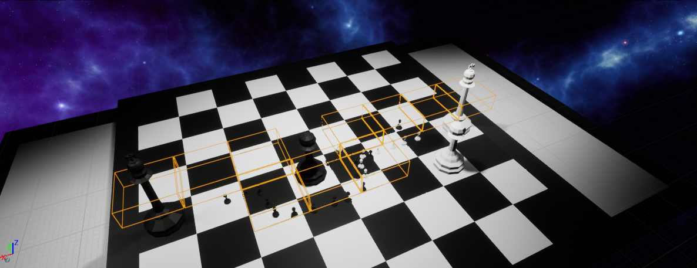
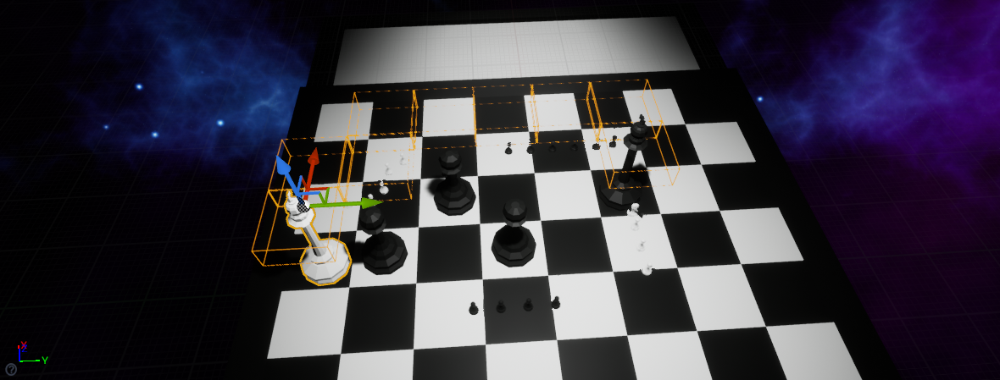

I've implement the A* algorithm to find the shortest path between the two kings, considering the blocked nodes (every chess piece with the exception of towers, which will serve as blockade for the mini pawns)

