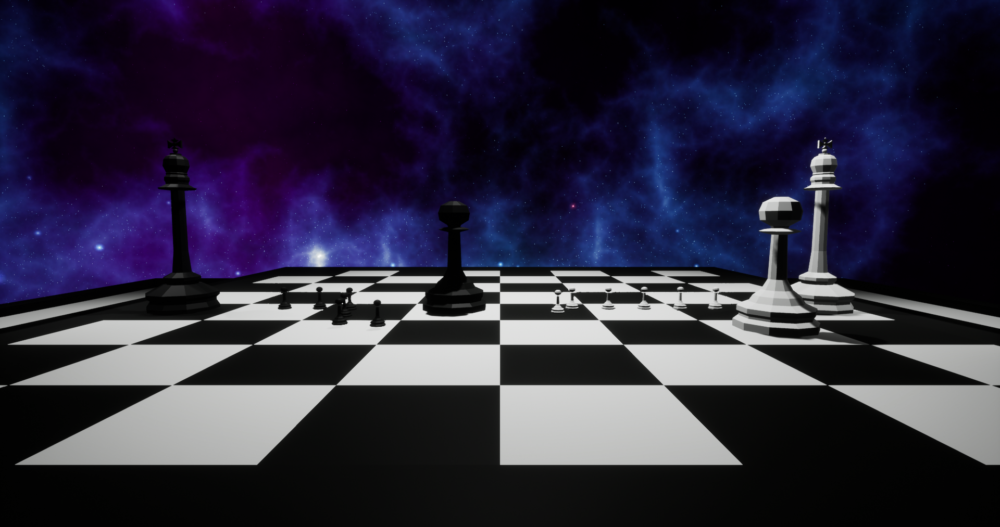

# Chess Defense

A tower defense game using chess pieces, made in Unreal 4.

## Goals

 - [x] [Create the 3d models:](https://lucasschurer.github.io/Chess-Defense/models)
    - [x] Pawn
    - [x] Bishop
    - [x] King
    - [x] Queen
    - [x] Tower
    - [x] Knight 
 - [x] [Implement A* pathfinding;](https://lucasschurer.github.io/Chess-Defense/astar)
 - [x] [Spawn the kings randomly, each one at its side of the chessboard;](https://lucasschurer.github.io/Chess-Defense/randomspawn)
 - [x] [Spawn the mini pawns, which will take the shortest route to the opponent's king;](https://lucasschurer.github.io/Chess-Defense/minipawns)
 - [x] [Implement mini pawns's death and the damage dealt to the other king;](https://lucasschurer.github.io/Chess-Defense/minipawns) 
 - [x] [Implement the pawn;](https://lucasschurer.github.io/Chess-Defense/pawn)
 - [ ] Implement the bishop;
 - [ ] Implement the tower;
 - [ ] Implement the knight;
 - [ ] Implement the queen;
 - [ ] Player movement and interaction:
    - [x] [Camera movement;](https://lucasschurer.github.io/Chess-Defense/camera)
    - [ ] Place pieces at the board;
    - [ ] Pass the turn;
 - [ ] Create the start menu;
 - [ ] Implement the turn mechanic;
 - [ ] Create an AI for the oponnent;
